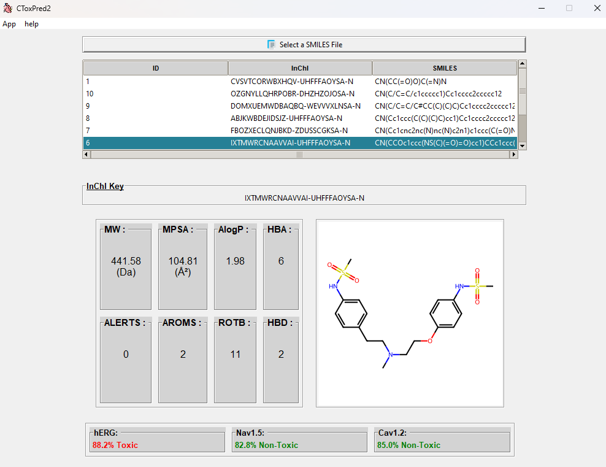
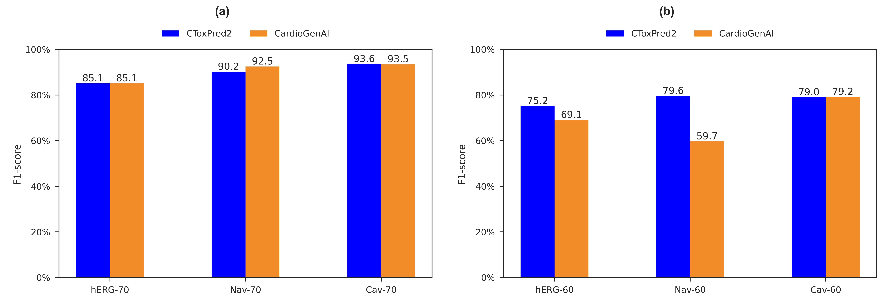

# CToxPred2
Comprehensive user-friendly cardiotoxicity prediction tool of small molecules on three targets: hERG, Nav1.5, Cav1.2

## Publication
If you use CToxPred2 in your work, please cite the following publication:

- Issar Arab, Kris Laukens, Wout Bittremieux, **Semi-Supervised Learning to Boost Cardiotoxicity Prediction by Mining a Large Unlabeled Small Molecule Dataset**, _bioRxiv_, (2024). [doi.org/10.1101/2024.05.25.595894](https://doi.org/10.1101/2024.05.25.595894)

## GUI

	

:exclamation:Clone first the whole repository package and follow the steps bellow.

## Prerequisites
1- Create and activate a conda environment:

		$conda create -n ctoxpred2 python=3.9
		$conda activate ctoxpred2

2- Install packages:

		$bash install.sh

3- Clone the repository: 

		$git clone git@github.com:issararab/CToxPred2.git

4- Move to the repository:

		$cd CToxPred2

5- Start the App:

		$python app.py
  
:exclamation:Before running the tool (step 5), ensure to decompress the models located under "CToxPred2 > models".

- To execute screening/predictions from a notebook, please consult the example provided at: notebooks/analysis_notebook.ipynb 
- To reproduce figures as published in the paper, start by decompressing the result CSV files under "CToxPred2/data/analyzed_sets". Then, utilize the notebook located at: notebooks/make_predictions.ipynb
- The software facilitates users to export the results as a CSV file and store them in a folder of their choosing.

## Data availability

To re-train the models, re-evaluate the models using the same test sets, or re-run the analysis notebook, you will find all the data in the folder './data'.
To access the complete library store containing approximately 2 million small molecules, including the entire ChEMBL database, and their corresponding feature representations, retrieve the publicly available database from [Zenodo](https://zenodo.org/records/11066707).

## Hot stuff

- Evaluation of the CToxPred2 performance compared to [CardioGenAI](https://arxiv.org/abs/2403.07632), trained and tested using the same data, where (a) is performance on Test-70 and (b) performance on Test-60. 

	

- t-SNE visualizations showing the distributions of the labeled and unlabeled molecules in the development set and the two external test sets (Eval-60 and Eval-70) for (a) hERG (b) Nav1.5 and (c) Cav1.2.

	

