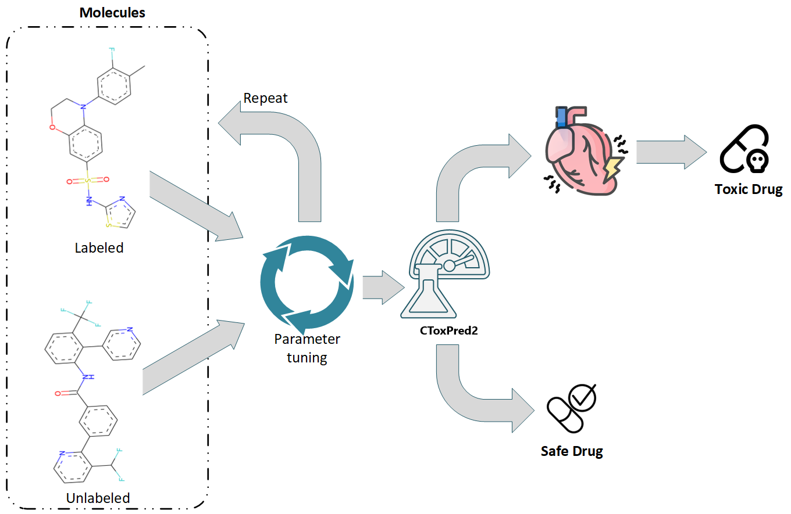

# CToxPred2
Comprehensive user-friendly cardiotoxicity prediction tool of small molecules on three targets: hERG, Nav1.5, Cav1.2

	

In ***computational drug discovery***, machine learning has significantly advanced the field, yet addressing ***uncertainty and confidence estimates*** remains crucial. Standard deep learning tools often fail to capture model uncertainty adequately, particularly in classification tasks where predictive probabilities can be misleadingly interpreted as model confidence. However, understanding uncertainty is vital for reliable predictions, especially when dealing with data far from the training set. Therefore, establishing when and to what extent a prediction can be considered reliable is just as important as outputting accurate predictions.

Bayesian probability theory offers a robust framework for addressing model uncertainty; however, its computational demands often lead scientists to seek alternative methods. To address this, techniques like MC-dropout have emerged, offering a practical approximation of Bayesian inference[1](https://proceedings.mlr.press/v48/gal16.html). Within the field of computational chemistry, methods such as MC-dropout, bootstrapping, and ensemble-based approaches have gained traction for estimating uncertainty and enhancing confidence in predictions[2](https://pubs.acs.org/doi/10.1021/acs.jcim.9b00975),[3](https://pubs.rsc.org/en/content/articlelanding/2019/sc/c9sc00616h),[4](https://pubs.rsc.org/en/content/articlelanding/2019/sc/c9sc01992h). In CToxPred2, we have developed a graphical user interface (GUI) to simplify usability, particularly for non-technical users. By adjusting the software's settings, ***the GUI allows users to choose between:*** deep neural network (DNN) models[5](https://pubs.acs.org/doi/abs/10.1021/acs.jcim.3c01301) trained using supervised learning with MC-dropout for uncertainty estimation and confidence prediction during inference, or random forest (RF) models trained in a semi-supervised learning (SSL) manner[6](https://www.biorxiv.org/content/10.1101/2024.05.25.595894v1). Notably, the RF models indirectly offer a form of confidence estimation through the mechanism of ensemble learning, where predictions are aggregated from multiple decision trees, each trained on a bootstrap sample of the dataset and utilizing a subset of the feature space.

## Publication
If you use CToxPred2 in your work, please cite the following paper:

- Issar Arab, Kris Laukens, Wout Bittremieux, **Semisupervised Learning to Boost hERG, Nav1.5, and Cav1.2 Cardiac Ion Channel Toxicity Prediction by Mining a Large Unlabeled Small Molecule Data Set**, _Journal of Chemical Information and Modeling_, (2024). [doi.org/10.1021/acs.jcim.3c01301](https://doi.org/10.1021/acs.jcim.4c01102)

	

:exclamation:Clone the whole repository and follow the steps bellow.

## Prerequisites
1- Create and activate a conda environment:

		$conda create -n ctoxpred2 python=3.9
		$conda activate ctoxpred2

2- Install packages:

		$bash install.sh

3- Clone the repository: 

		$git clone git@github.com:issararab/CToxPred2.git

4- Move to the repository:

		$cd CToxPred2

5- Start the App:

		$python app.py
  
:exclamation:Before running the tool (step 5), ensure to decompress the models located under "CToxPred2 > models".

- To execute screening/predictions from a notebook, please consult the example provided at: notebooks/analysis_notebook.ipynb 
- To reproduce figures as published in the paper, start by decompressing the result CSV files under "CToxPred2/data/analyzed_sets". Then, utilize the notebook located at: notebooks/make_predictions.ipynb
- The software facilitates users to export the results as a CSV file and store them in a folder of their choosing.

## Data availability

To re-train the models, re-evaluate the models using the same test sets, or re-run the analysis notebook, you will find all the data in the folder './data'.
To access the complete library store containing approximately 2 million small molecules, including the entire ChEMBL database, and their corresponding feature representations, retrieve the publicly available database from [Zenodo](https://zenodo.org/records/11066707).

## Hot stuff

- Evaluation of the CToxPred2 performance compared to [CardioGenAI](https://arxiv.org/abs/2403.07632), trained and tested using the same data, where (a) is performance on Test-70 and (b) performance on Test-60. 

	

- t-SNE visualizations showing the distributions of the labeled and unlabeled molecules in the development set and the two external test sets (Eval-60 and Eval-70) for (a) hERG (b) Nav1.5 and (c) Cav1.2.

	

